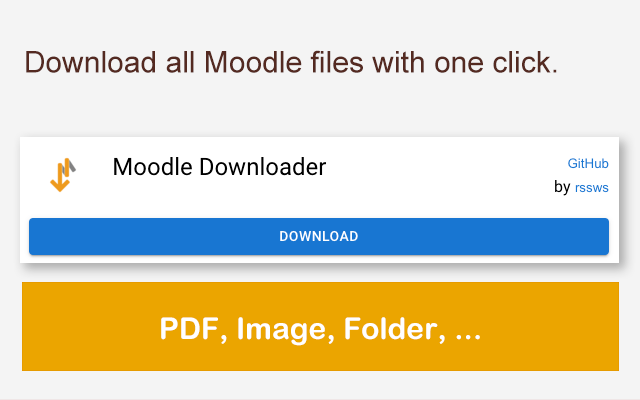
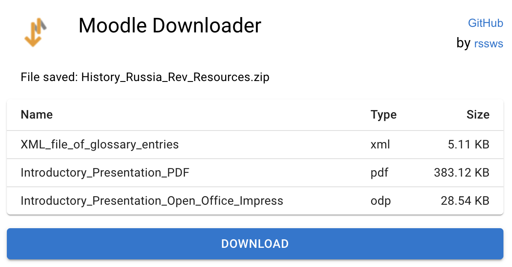

# Moodle Downloader Extension

Moodle downloader extension for Chrome. 
The extension is tested with both the [TUM moodle](https://moodle.tum.de) and [the official moodle demo](https://moodle.org/demo).

Please submit an issue if you found any bugs or have feature requests.

**If you like the tool, please star this repository and share it with your friends. :)**

## Installation
### Install from the `Chrome Extension Store`
Visit the [Moodle Downloader Extension](https://chrome.google.com/webstore/detail/moodle-downloader/egdkcpdcopinmhfphdmdagnpogclbpln) in the Chrome Extension Store.

### Install from the zip file
1. Download the extension on the [latest release](https://github.com/rssws/moodle-dl-ext/releases) page.
2. Unzip the `zip` file to a folder.
3. Open Chrome and go to `chrome://extensions/`.
4. Click on `Load unpacked` and select the folder from `step 2`.
5. Done. You can now find the extension in the list.

## Usage
1. Navigate to one of the following pages:
   1. Course view: `https://.../course/view.php?id=...`
      - Download all the resources of a course.
   2. Resource view: `https://.../course/resources.php?id=...`
      - Download all the resources of a course.
   3. Folder view: `https://.../mod/folder/view.php?id=...`
      - Download all the resources in a folder.
   4. Pluginfile: `https://.../pluginfile.php/.../mod_resource/content/.../...`
      - Download the opened file.
2. Click on the extension.
3. Click on `Download` button and wait for the download to complete. 
   It may take a while depending on the network condition.
   You can close the extension or view other tabs.
   The file will be saved once the download has been completed.

## Development
This monorepo is managed using `turborepo`. It contains two packages `@moodle-dl-ext/popup` and `@moodle-dl-ext/content-script`.

### @moodle-dl-ext/popup
This package is built for the popup page using `React` and `typescript`.
The `manifest.json` and other static resources can be found in `packages/popup/public`.

### @moodle-dl-ext/content-script
This package is built for the content script and packaged using `Webpack` and `typescript`.

### How to build
1. Clone or download the repository.
2. Install `yarn`.
   1. Run `npm install -g yarn` to install `yarn`.
   2. Run `yarn set version berry` to enable the modern `yarn`.
3. Run `yarn install` to install dependencies.
4. Generate the extension using `yarn package`.
5. Import the extension using the generated folder `output`.

## License
[GPL-3.0](./LICENSE)
